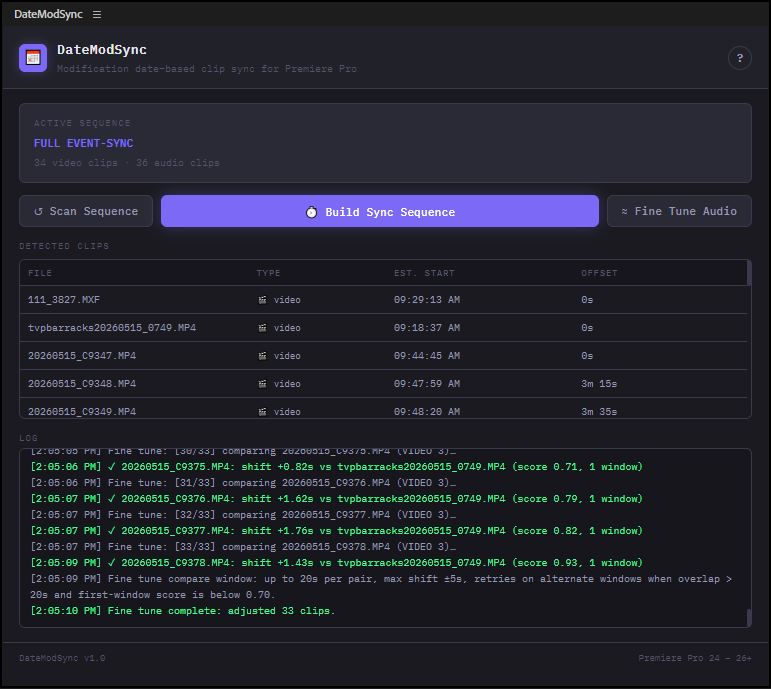

# DateModSync — Premiere Pro CEP Extension

Syncs video/audio clips onto a new timeline based on their **file modification date** (`mtime`), reconstructing real-world recording gaps without timecode or metadata.

Tested against **Adobe Premiere Pro 24, 25, and 26**.

---



---

## How it works

| Step | Detail |
|------|--------|
| 1 | `date modified` of a clip file ≈ when that recording **finished** |
| 2 | `date modified − clip duration` = when the camera hit **Record** |
| 3 | DateModSync repeats this for every clip, then places them on a new sequence so the gaps between clips match real clock time |

> **Important:** preserve file dates when copying media. If the OS updates `mtime` on copy (e.g. some cloud sync tools do this), the estimated record-start time will be wrong.

---

## Compatibility

| Item | Requirement |
|------|-------------|
| **Premiere Pro** | 24 (2024), 25 (2025), 26 (2026) and later |
| **CEP runtime** | CSXS 11.0+ |
| **Node.js bridge** | CEP `--enable-nodejs` flag (already set in manifest) |
| **ffmpeg** | Required for **Fine Tune Audio** only — must be on system PATH |
| **OS** | macOS or Windows |

---

## Installation

### Step 1 — Enable unsigned CEP extensions (one-time)

Premiere Pro won't load unsigned extensions by default. Run the appropriate command once:

**macOS** (Terminal):
```bash
defaults write com.adobe.CSXS.11 PlayerDebugMode 1
```

**Windows** (Command Prompt as Administrator):
```
reg add HKEY_CURRENT_USER\Software\Adobe\CSXS.11 /v PlayerDebugMode /t REG_STRING /d 1
```

> The key is `CSXS.11` for Premiere Pro 24–26. If you are on an older version, check your CEP version and adjust the number accordingly.

### Step 2 — Copy the extension folder

Place the `DateModSync` folder into your CEP extensions directory:

| Platform | Path |
|----------|------|
| macOS    | `~/Library/Application Support/Adobe/CEP/extensions/` |
| Windows  | `%APPDATA%\Adobe\CEP\extensions\` |

Result: `.../CEP/extensions/DateModSync/CSXS/manifest.xml`

### Step 3 — Launch Premiere Pro

Go to **Window → Extensions → DateModSync**.

---

## Usage

### Basic sync

1. Open your project and make the sequence you want to sync the **active sequence** (double-click it in the Project panel).
2. In the DateModSync panel, click **↺ Scan Sequence**.  
   The panel reads every clip in the sequence and looks up its `mtime` via Node.js `fs.statSync()`.
3. Review the **Detected Clips** table — it shows each clip's file name, type, estimated record-start time, and offset from the earliest clip.
4. Click **⏱ Build Sync Sequence**.  
   A new sequence named `[original name]-SYNC` is created and opened. Clips are placed at their real-clock-time positions; gaps between recordings are preserved.
5. **Manually align tracks** — after the sync sequence is built, use the Selection tool to drag each track so that **one clip** lines up close to the corresponding clip on the base track. Because `mtime` accuracy can vary by roughly **±1 second** per clip, this rough alignment only needs to be in the ballpark. Once every track is roughly aligned, run **Fine Tune Audio** for precise micro-adjustments.

### Fine Tune Audio

Fine Tune refines the rough `mtime`-based sync using **audio waveform cross-correlation** via ffmpeg. Just click the button — there is no configuration needed. It runs automatically after the sync sequence has been built and tracks have been roughly aligned.

1. Click **≈ Fine Tune Audio**.
2. The plugin compares each non-base track against the tracks below it and calculates the best sub-second shift for each clip.
3. Only shifts greater than **20 ms** are applied — smaller differences are considered already close enough.

**How the algorithm works:**

- Searches for the best lag within **±5 seconds** of the current position.
- Extracts up to **20 seconds** of audio per comparison pair (needs at least **3 seconds** of overlap between clips).
- Samples the overlap at three positions — centred (50%), early (20%), and late (80%) — to avoid locking onto an unrepresentative section.
- If the centred window already produces a strong match (confidence ≥ 0.70), the remaining windows are skipped for speed.
- Each non-base layer is compared against all lower layers; the highest-confidence pair determines the final shift.

> **ffmpeg must be on PATH.** Install from [ffmpeg.org](https://ffmpeg.org/download.html) and confirm with `ffmpeg -version` in a terminal before using this feature.

---

## Caveats

| Consideration | Notes |
|---------------|-------|
| **Local files only** | `mtime` is read via `fs.statSync()`. Network drives or cloud-synced folders may not report reliable dates. |
| **mtime accuracy** | Some copy tools (rsync without `--times`, cloud sync apps) reset `mtime`. Use tools that preserve file dates when transferring media. |
| **~1s per-clip variance** | `mtime` resolution and filesystem timing mean each clip's calculated start time can be off by up to ~1 second. Tracks need a manual rough alignment after building; Fine Tune corrects the residual. |
| **Camera clock drift** | The sync is relative. If two cameras have different system clocks, the relative gap is preserved as-is. Use Fine Tune to correct residual drift. |
| **Linked audio** | The plugin processes video-track clips; linked audio follows via Premiere's clip model. Audio-only tracks are handled on dedicated audio tracks. |
| **Sequence must be active** | Double-click the sequence in the Project panel before scanning — the panel operates on the sequence currently open in the timeline. |

---

## File structure

```
DateModSync/
├── CSXS/
│   └── manifest.xml       # CEP extension definition (bundle ID, host versions)
├── jsx/
│   └── sync.jsx           # ExtendScript: sequence read + build logic
├── js/
│   ├── CSInterface.js     # Adobe CEP bridge library
│   └── main.js            # Panel logic: mtime lookup, UI, Fine Tune
├── css/
│   └── style.css          # Panel styles
└── index.html             # Panel HTML (includes Instructions view)
```
