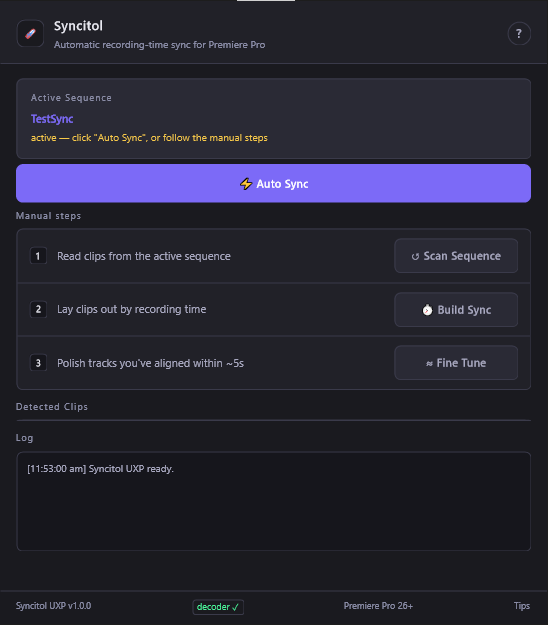

# Syncitol

Syncitol: fast relief from manual multicam sync in Premiere Pro.

Point it at a multicam sequence — separate cameras, audio recorders, whatever
— and it rebuilds real recording-time sync automatically: reads each clip's
real record-start time (embedded metadata, falling back to file dates), lays
everything out on a new timeline so the gaps match real clock time, then
fine-aligns the audio by waveform. One click ("⚡ Auto Sync") runs the whole
pipeline. Free, and it's yours to keep.

If Syncitol saves you a re-sync session, consider tipping on
[Ko-fi](https://ko-fi.com/thinkvp) — it's genuinely appreciated.

## Which version do I need?

Syncitol ships as two separate plugins, built for different Premiere generations:

| | [`uxp/`](uxp/) — UXP plugin | [`cep/`](cep/) — CEP extension |
|---|---|---|
| **Premiere Pro** | 26.0+ | 24, 25, 26+ |
| **OS** | Windows, macOS | Windows or macOS |
| **ffmpeg** | Bundled — no install needed | System install needed (Fine Tune Audio only) |
| **Install** | Download `.ccx`, double-click | Windows installer `.exe`, or ZXP via extension manager |

- **On Windows or macOS with Premiere 26+:** use the **UXP** version — simpler,
  self-contained, and it's where Adobe's extensibility platform is headed.
- **On an older Premiere (24/25):** use the **CEP** version.

### Why two versions?

Adobe is moving Premiere's plugin platform from CEP to UXP. UXP hybrid plugins
(the kind Syncitol needs for its bundled FFmpeg decoder) require Premiere 26+,
while CEP extensions work back to Premiere 24. UXP is where Adobe's platform is
headed; CEP covers older installs. Both are maintained and kept at the same
version.

## Download

Grab the latest release for your platform from
**[Releases](https://github.com/thinkvp/Syncitol/releases)** — each release
(tagged `v*`) bundles all artifacts: the UXP `.ccx`, CEP Windows installer
`.exe`, and CEP `.zxp`.

See [`uxp/README.md`](uxp/README.md) or [`cep/README.md`](cep/README.md) for
exact install steps.

## License

[MIT](LICENSE) for Syncitol's own code. Bundled third-party components (IBM
Plex fonts, FFmpeg) keep their own licenses — see [`LICENSE`](LICENSE) for
details.
