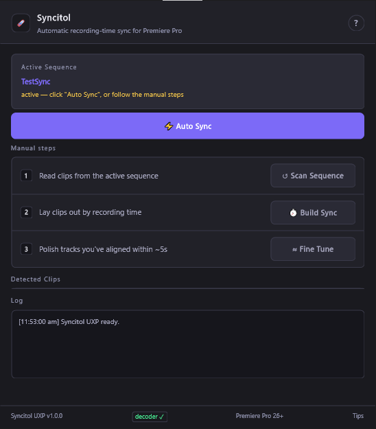

# Syncitol

Syncitol: fast relief from manual multicam sync in Premiere Pro.

Point it at a multicam sequence — separate cameras, audio recorders, whatever
— and it rebuilds real recording-time sync automatically: reads each clip's
real record-start time (embedded metadata, falling back to file dates), lays
everything out on a new timeline so the gaps match real clock time, then
fine-aligns the audio by waveform. One click ("⚡ Auto Sync") runs the whole
pipeline. Free, and it's yours to keep.

If Syncitol saves you a re-sync session, consider tipping on
[Ko-fi](https://ko-fi.com/thinkvp) — it's genuinely appreciated.

## Requirements

| | |
|---|---|
| **Premiere Pro** | 26.0 or later |
| **OS** | Windows (x64) or macOS (arm64 / x86_64) |
| **ffmpeg** | Bundled — no install needed |
| **Install** | Download the `.ccx`, double-click |

Syncitol is a UXP plugin. The bundled FFmpeg decoder is a UXP *hybrid* addon,
which Premiere only loads from 26.0 onward — on 25.x the panel opens but the
decoder reports "Addon is not supported".

> **Premiere 24/25 users:** Syncitol previously also shipped as a CEP
> extension for older Premiere generations. That version is discontinued and
> is no longer developed or released. The last CEP builds remain downloadable
> from the [v1.3.0 release](https://github.com/thinkvp/Syncitol/releases/tag/v1.3.0)
> and earlier, unsupported and as-is.

## Download

Grab the latest release from
**[Releases](https://github.com/thinkvp/Syncitol/releases)** — each release
(tagged `v*`) ships `Syncitol-UXP-<version>.ccx`, with the Windows and macOS
native addons bundled in.

See [`uxp/README.md`](uxp/README.md) for exact install steps.

## License

[MIT](LICENSE) for Syncitol's own code. Bundled third-party components (IBM
Plex fonts, FFmpeg) keep their own licenses — see [`LICENSE`](LICENSE) for
details.

Release history: [`CHANGELOG.md`](CHANGELOG.md).
